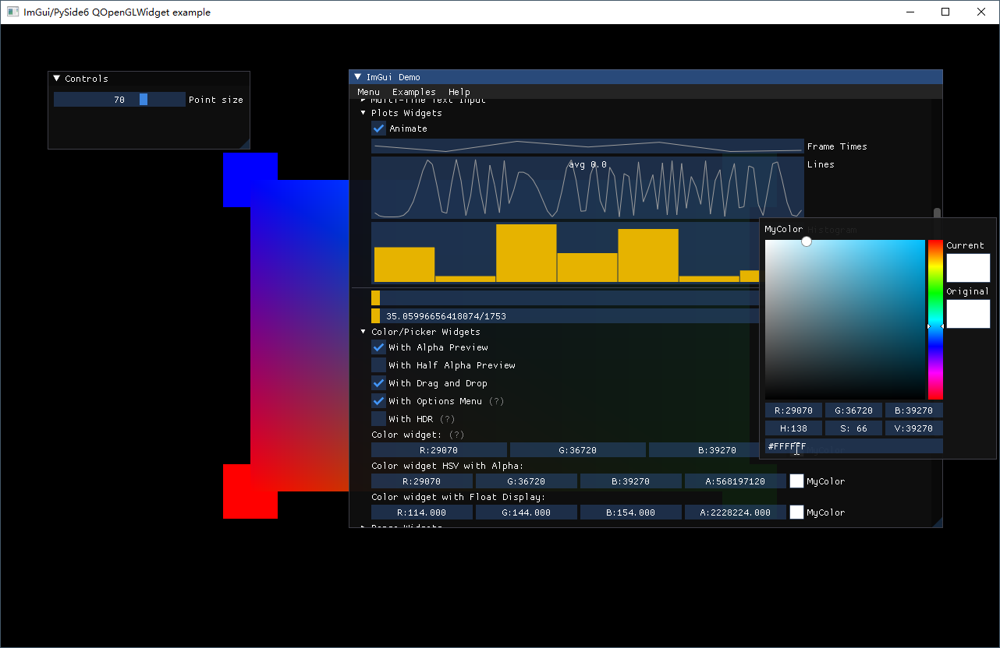

# pyside6-imgui
PySide6-imgui is a cute helper to embed imgui in PySide6 QOpenGLWidget by using [pyimgui](https://github.com/pyimgui/pyimgui/).

Tested on Python 3.10.6, OpenGL 4.6, pyimgui 2.0.0, PySide6 6.3.0 and Windows 10 OS

## Screenshot


## Requirements
* PySide6
* PyOpenGL
* numpy
* pyimgui

## How to use
The repo includes the class PySide6Renderer which inherits from QObject and ProgrammablePipelineRenderer:
```python
import imgui
from imgui.integrations.opengl import ProgrammablePipelineRenderer

from PySide6.QtOpenGLWidgets import QOpenGLWidget
from PySide6.QtCore import QObject, QEvent, Qt, QDateTime
from PySide6.QtWidgets import QApplication
from PySide6.QtGui import QMouseEvent, QWheelEvent, QKeyEvent, QCursor

class PySide6Renderer(QObject, ProgrammablePipelineRenderer):
```

In your QOpenGLWidget instance, you need to import PySide6Renderer, initialize imgui in initializeGL, and then use imgui elements in paintGL:
```python
from pyside6 import PySide6Renderer

	def initializeGL(self) -> None:
		# do your initialization

		# initialize imgui
		imgui.create_context()
		self.impl = PySide6Renderer(self)

    def paintGL(self) -> None:
		# draw your scene
		
        # define imgui elements
        self.impl.process_inputs()
        imgui.new_frame()

        imgui.begin("Controls")
        point_size = int(self.psize)
        changed, point_size = imgui.slider_int("Point size", point_size, 1, 100)
        self.psize = float(point_size)
        imgui.end()

        # render imgui
        imgui.render()
        self.impl.render(imgui.get_draw_data())		
```

## Run demo
Clone the repository, and then

cd pyside6-imgui

python integrations_pyside6.py

## Acknowledgments
Thanks below authors of repos to help me learn some necessary knowledge to put everything together.

[pyimgui](https://github.com/pyimgui/pyimgui/)

[QtImGui](https://github.com/seanchas116/qtimgui/)

[Lifeblood](https://github.com/pedohorse/lifeblood/)
